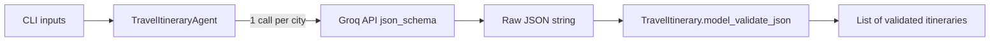

# Travel Itinerary Agent (Groq + Pydantic)

Build a greenfield Python script that calls the Groq SDK once per destination city, enforces a Pydantic-defined JSON schema via Groq structured outputs, and validates each response before printing results.

## Todos

- [ ] Create `requirements.txt`, `.env.example` with groq + pydantic
- [ ] Define `DailyPlan` and `TravelItinerary` Pydantic models with day-count validator in `schemas.py`
- [ ] Implement Groq client, prompt builder, per-destination API loop, and layered error handling in `agent.py`
- [ ] Add argparse CLI in `main.py` (source, --dest, --days, --budget) and JSON output
- [ ] Smoke-test with `GROQ_API_KEY` and confirm one itinerary per destination

## Architecture



**Inputs (CLI):**

- `source_city` (str)
- `destinations` (list of str, e.g. `--dest Paris --dest Rome`)
- `trip_duration_days` (int)
- `budget_category` (str, e.g. `budget`, `moderate`, `luxury`)

**Output:** One validated `TravelItinerary` JSON object per destination city, printed to stdout.

---

## Project layout

Greenfield repo — create a minimal, focused structure:

| File | Purpose |
|------|---------|
| `requirements.txt` | `groq`, `pydantic` (pin recent stable versions) |
| `.env.example` | `GROQ_API_KEY=your_key_here` |
| `schemas.py` | Pydantic models |
| `agent.py` | Groq client, prompt builder, API call + validation |
| `main.py` | CLI entry point using `argparse` |

No extra dependencies (Instructor, pydantic-ai, etc.) — user asked for Groq SDK + Pydantic directly.

---

## Pydantic schema (`schemas.py`)

```python
class DailyPlan(BaseModel):
    day: int
    activities: list[str]

class TravelItinerary(BaseModel):
    destination: str          # single city name for this itinerary
    trip_duration_days: int
    budget_category: str
    top_attractions: list[str]
    daily_plan: list[DailyPlan]
```

Add lightweight post-validation in `TravelItinerary` (via `@model_validator`) to ensure:

- `len(daily_plan) == trip_duration_days`
- Each `day` is `1..trip_duration_days` with no duplicates

This catches LLM drift even when JSON schema is satisfied.

---

## Groq integration (`agent.py`)

**Model:** `llama-3.3-70b-versatile` (supports Groq [Structured Outputs](https://console.groq.com/docs/structured-outputs) via `json_schema`).

**Per-destination flow:**

1. Build a system + user prompt including `source_city`, the **single** target destination, `trip_duration_days`, and `budget_category`.
2. Pass Pydantic schema to Groq:

```python
response = client.chat.completions.create(
    model="llama-3.3-70b-versatile",
    messages=[system_msg, user_msg],
    response_format={
        "type": "json_schema",
        "json_schema": {
            "name": "travel_itinerary",
            "schema": TravelItinerary.model_json_schema(),
        },
    },
)
```

3. Extract `response.choices[0].message.content`.
4. Validate with `TravelItinerary.model_validate_json(content)`.
5. Loop over all destinations; collect results (continue or fail-fast on first error — default **fail-fast** with clear error message).

**Prompt design (concise):**

- System: travel planner role; must return JSON matching schema; `daily_plan` must have exactly N days; activities should be realistic for the given `budget_category`.
- User: structured trip request with source, one destination, duration, budget.

---

## Error handling (`agent.py`)

Wrap each API call in layered try/except:

| Layer | Exception | Action |
|-------|-----------|--------|
| API | `groq.APIError`, `groq.RateLimitError`, `groq.APIConnectionError` | Log destination + error; re-raise or exit with code 1 |
| Response | Empty/missing `content` | Raise `ValueError` with model + destination context |
| Parse | `json.JSONDecodeError` | Wrap and report raw snippet |
| Validate | `pydantic.ValidationError` | Print field-level errors; exit 1 |

Also validate `GROQ_API_KEY` at startup (from env); fail early with a helpful message if missing.

---

## CLI (`main.py`)

Use `argparse`:

```bash
python main.py \
  --source "New York" \
  --dest "Paris" --dest "Rome" \
  --days 5 \
  --budget moderate
```

- `--source` (required)
- `--dest` (required, repeatable)
- `--days` (required, int > 0)
- `--budget` (required, choices: `budget`, `moderate`, `luxury`)

Print each validated itinerary as indented JSON (`model_dump_json(indent=2)`) separated by a blank line.

---

## Example output shape (one object per city)

```json
{
  "destination": "Paris",
  "trip_duration_days": 5,
  "budget_category": "moderate",
  "top_attractions": ["Eiffel Tower", "Louvre", "..."],
  "daily_plan": [
    {"day": 1, "activities": ["...", "..."]},
    {"day": 2, "activities": ["...", "..."]}
  ]
}
```

---

## Verification

After implementation:

1. Set `GROQ_API_KEY` in environment.
2. Run CLI with 2 destinations and confirm 2 separate validated JSON blocks.
3. Confirm validation rejects malformed output (can unit-test `TravelItinerary.model_validate_json` with bad fixtures locally, no API needed).
